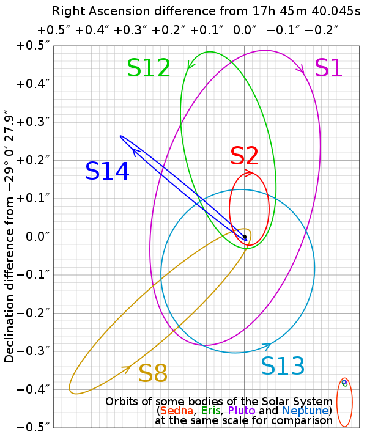

# Simulating Steller Orbits Around Sagittarius A

Arian Andalib, Nate Gu, Elias Taira

## Introduction

While Sagittarius A (Sag A for short) has been observed many times and have been confirmed to be the center of our galaxy since as early as the 1980's, it wasn't until the 2000s that this "star" was confirmed to be a black hole. Even more recently, we have been able to observe the orbits of stars very close to the black hole. Then, using Kepler's Laws to map out the orbital path of the stars, obtain an accurate reading of what the mass of this black hole is.

After a careful analysis of the astronomical data, it was found that the bleck hole weighs around $3.6^{+0.2}_{-0.4}*10^6 M_\odot$ 

The actual data for these orbits can be found below from the Wikepidia page on Sag A
