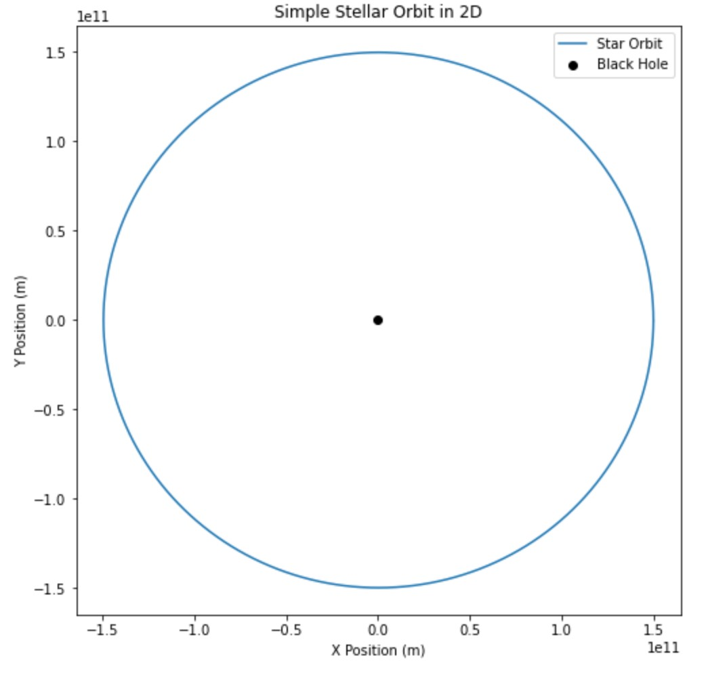

# Simulating Steller Orbits Around Sagittarius A

Arian Andalib, Nate Gu, Elias Taira

## Introduction

While Sagittarius A (Sag A for short) has been observed many times and have been confirmed to be the center of our galaxy since as early as the 1980's, it wasn't until the 2000s that this "star" was confirmed to be a black hole. Even more recently, we have been able to observe the orbits of stars very close to the black hole. Then, using Kepler's Laws to map out the orbital path of the stars, obtain an accurate reading of what the mass of this black hole is.


After a careful analysis of the astronomical data, it was found that the bleck hole weighs around $3.6^{+0.2}_{-0.4}*10^6 M_\odot$ 

The actual data for these orbits can be found below from the Wikepidia page on Sag A:


In this experiment, we seek to understand nderlying physics behind this orbital motion. Thus we decided to try to reconstruct this system with these same orbital patterns using nothing but the gravitational forces between the orbiting stars and central black hole, as well as the initial positions and velocities of the stars as well.

To do this, we will employ the use of the **Velocity Verlet method**, an iterative method designed to solve various kinds of differential equations. In the scope of this project we will use it to solve for the positions and velocities of the nearby stars orbiting Sag A given their initial position, velocity and the gravitational force exerted on them by the central black hole all as a function of time.

The differential equation we will be solving is denoted by: $$a(r) = \frac{GM_sr}{\textbf{r}^3} $$ where $a(r)$ represents the acceleration of the star (derived from the gravitational force), $G$ represents the gravitational constant ($6.67*10^{-11} m^3 kg^{-1} s^{-2}$), $M_s$ represents the mass of Sag A, **r** represents the distance to Sag A in meters and, r represents the position vector of the star.

To obtain these initial conditions, we decided to use the **q (AU)** column for position and the  **v(%c)** column for velocity. **q (AU)** represents the distance of the star from the black hole at its **perhilion**, the closest point to the black hole in the star's orbital path. This distance is measured in **AU** or **Astronomical Units**, which represent the distance from Earth to the Sun (i.e., the distance from Earth to the Sun is 1 AU or ~1.5e11 m). However, for this project we will be working in SI units, so this will be converted into meters. **v(%c)** represents the speed of the star at this perhilion location. This is units of **%c** where 'c' represents the speed of light at $3*10^8$ m/s. We will also be using this in SI units as well (m/s).

## Methodology

In the process of making an accurate model for the Sag A system, we decided that it would be best to first start out with a simpler model of our system in a lower dimension to ensure that the basics of our model are functioning as they should before we add any more complexity to our model. Therefore, we will first try to build our model in 2 dimensions.

The majority of our code will be found in the form of classes and objects located within the file 'system.py'. There we create objects for each star in the system ('star' class), as well as an object for simulating each star object as they move through their respecive orbits ('system2d' class).

To validate that our Velocity Verlet method is functioning as it should, we first made a simple simulation of a black hole and star system with similar masses to that of our own Sun and Earth respectively.

To do this, we must first import the libraries we will be using: Numpy and Matplotlib. While we will import more libraries in order to run some animations and make 3-D plots, those libraries will be imported in 'system.py'. Only having numpy in the notebook will be sufficient enough to initialize our data. Additionally we will also import our classes from 'system.py'

```
import numpy as np
import matplotlib.pyplot as plt

%reload_ext autoreload
%autoreload 2
from system import star, system2d
```

Now we are able to run our basic simulation.

```
plt.figure(figsize = (8,8))
plt.plot(test_star.r[:,0],test_star.r[:,1], label = "Star Orbit")
plt.scatter(0,0, color = "black", marker = "o", label = "Black Hole")
plt.xlabel("X Position (m)")
plt.ylabel("Y Position (m)")
plt.title("Simple Stellar Orbit in 2D")
plt.legend()
```

This should output a plot that is something like:


