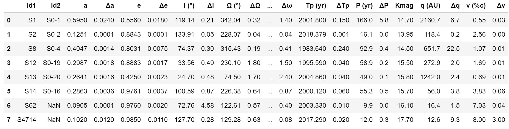

# Simulating Steller Orbits Around Sagittarius A

Arian Andalib, Nate Gu, Elias Taira

## Introduction

While Sagittarius A (Sag A for short) has been observed many times and have been confirmed to be the center of our galaxy since as early as the 1980's, it wasn't until the 2000s that this "star" was confirmed to be a black hole. Even more recently, we have been able to observe the orbits of stars very close to the black hole. Then, using Kepler's Laws to map out the orbital path of the stars, obtain an accurate reading of what the mass of this black hole is.


After a careful analysis of the astronomical data, it was found that the bleck hole weighs around $3.6^{+0.2}_{-0.4}*10^6 M_\odot$ 

The actual data for these orbits can be found below from the Wikepidia page on Sag A:



In this experiment, we seek to understand nderlying physics behind this orbital motion. Thus we decided to try to reconstruct this system with these same orbital patterns using nothing but the gravitational forces between the orbiting stars and central black hole, as well as the initial positions and velocities of the stars as well.

To do this, we will employ the use of the **Velocity Verlet method**, an iterative method designed to solve various kinds of differential equations. In the scope of this project we will use it to solve for the positions and velocities of the nearby stars orbiting Sag A given their initial position, velocity and the gravitational force exerted on them by the central black hole all as a function of time.

The differential equation we will be solving is denoted by: $$a(r) = \frac{GM_sr}{\textbf{r}^3} $$ where $a(r)$ represents the acceleration of the star (derived from the gravitational force), $G$ represents the gravitational constant ($6.67*10^{-11} m^3 kg^{-1} s^{-2}$), $M_s$ represents the mass of Sag A, **r** represents the distance to Sag A in meters and, r represents the position vector of the star.

To obtain these initial conditions, we decided to use the **q (AU)** column for position and the  **v(%c)** column for velocity. **q (AU)** represents the distance of the star from the black hole at its **perhilion**, the closest point to the black hole in the star's orbital path. This distance is measured in **AU** or **Astronomical Units**, which represent the distance from Earth to the Sun (i.e., the distance from Earth to the Sun is 1 AU or ~1.5e11 m). However, for this project we will be working in SI units, so this will be converted into meters. **v(%c)** represents the speed of the star at this perhilion location. This is units of **%c** where 'c' represents the speed of light at $3*10^8$ m/s. We will also be using this in SI units as well (m/s).

## How the Model Works

### Escape velocities

Before we plot the orbits we need to figure out whether the stars follow newtonian mechanics and dont rely on realtavistic effects. What that means is that our code can only support certain velocity thresholds and anything above that will cause the code to break. 

The way we do this is by making functions of the system2D file that calculates the Escape velocity and plots the stars on it and finally finds whether they lie abouve or below the escape velocity of the black hole.

First we need to initialize the stars that are orbiting the black hole.
```
SA = star(Inital position A, Initial velocity A) 
SB = star(Inital position B, Initial velocity B) 
```
Then we need to figure out the escape velocity from the Black hole as a function of distance from the black hole. The labels help with labeling the stars on the plot.
```
star_list=[SA,SB]
plt.figure(figsize=(9,6))
test_system.Escape_velocity(star_list)
labels= ["SA","SB"]
test_system.ScatterStars(star_list,labels)

```
For our example we used stars around sagitarius A. Here is what our plot looks like.


Finally we need to see if the initial velocity of the stars is above or below the escape velocity thus you need to calculate the residuals.

```
test_system.Residuals(star_list,labels)
```
which should give you something like this.
```
The residual for s1 is -167020.70258297282
The residual for s2 is -82136.225303608
The residual for s8 is -98516.08981197374
The residual for s12 is -42759.256721738726
The residual for s13 is -326604.1863571396
The residual for s14 is 203400.93013891205
The residual for s16 is 233799.77611472458
The residual for s4714 is 205759.93473405018
```
If the value is positive it means that the star does not follow Newtonian Mechanics and will therefore not be applicable to our model.

Looking at the escape velocities, we find that stars: s14, s16 and s4714 are not applicable for our model, so we will not be including them in our analysis.

### 2D Model

In the process of making an accurate model for the Sag A system, we decided that it would be best to first start out with a simpler model of our system in a lower dimension to ensure that the basics of our model are functioning as they should before we add any more complexity to our model. Therefore, we will first try to build our model in 2 dimensions.

The majority of our code will be found in the form of classes and objects located within the file 'system.py'. There we create objects for each star in the system ('star' class), as well as an object for simulating each star object as they move through their respecive orbits ('system2d' class).

To validate that our Velocity Verlet method is functioning as it should, we first made a simple simulation of a black hole and star system with similar masses to that of our own Sun and Earth respectively.

To do this, we must first import the libraries we will be using: Numpy and Matplotlib. While we will import more libraries in order to run some animations and make 3-D plots, those libraries will be imported in 'system.py'. Only having numpy in the notebook will be sufficient enough to initialize our data. Additionally we will also import our classes from 'system.py'

```
import numpy as np
import matplotlib.pyplot as plt

%reload_ext autoreload
%autoreload 2
from system import star, system2d
```

Now we are able to run our basic simulation.

To begin, we must first by initializing our objects for the model, starting with the 'star' objects. The only arguments required for these objects are the initial position and velocity of the star, in meters and meters/second respectively
```
r0 = [1.5e11,0] # in units of meters(m), represents the initial position in [x,y]
v0 = [0,2.98e4] # in units of meters per second (m/s), represents the initial velocity in [v_x,v_y]

test_star = star(r0,v0) # creates a star object with an initial velocity and position
```

Next we initialize our system. The arguments for this object are slightly more complex. Here we require several different arguments: The mass of the central black hole (in kg) and a list of star objects
```
black_hole_mass = 2e30 # in kilograms (kg)

test_list = [test_star] # system2d class takes in a list of star objects as an argument 
                        # can be any non-zero length in size 
                        # must only compose of star objects

test_system = system2d(test_list,black_hole_mass) # creates a 2d system object using the 
                                                  # star list and the mass of the central black hole

```

Now it is finally time to put our planet into orbit. We will now run the '.iterate()' method to iterate through our Velocity-Verlet method to output the positions and velocities of each of the stars within the system (but in this case, we're only using 1 star). For this step, we only need two arguments: the length of time we will iterate for, denoted by tf, and the amount of time between each iteration, represented by dt.

```
tf = 365*24*3600 # iterating for 1 year in units of seconds (s)
dt =  tf/1000 # Amount of time between iterations, set such that there ar 1000 iterations
test_system.iterate(tf,dt) # running the iterate method, positions and velocities are sotred within each star object # Running the Velocity-Verlet Method
```

The actual values for the position and velocity over this time interval are stored within the star objects. Therefore, by accessing the star's position and velocity features (denoted by '.r' and '.v'), we can evalueate their motion. In the following cell, we plot out the path of the star as it orbits the black hole using the star's position feature.

```
plt.figure(figsize = (8,8))
plt.plot(test_star.r[:,0],test_star.r[:,1], label = "Star Orbit")
plt.scatter(0,0, color = "black", marker = "o", label = "Black Hole")
plt.xlabel("X Position (m)")
plt.ylabel("Y Position (m)")
plt.title("Simple Stellar Orbit in 2D")
plt.legend()
```

This should output a plot that is something like:


As a built-in method in our system2d class, we have a function for displaying an animation of our star objects as they orbit the black hole called '.plot()' which takes in a single value for the x-bounds and another value for the y-bounds. Like the '.iterate()' function, it also takes in a final time and timestep size argument to determine how long we want the animation to run for and how smooth we want the animation to be. These values can be determined independently of the '.iterate()', but they must still be in units of seconds.

To create an animation of the prior example, we use the '.plot()' method. This method takes in values of x bounds and y bounds for the plot (in meters) denoted by 'xlim' and 'ylim' that determine the size of the animation frame. This method also takes in 'tf' and 'dt' arguments that determine the length of time the animation takes as well as the amount of time that passes between each animation frame respecively
```
xlim = [-1.6e11,1.6e11] # seting x bounds of plot
ylim = [-1.6e11,1.6e11] # seting y bounds of plot

test_system.plot(xlim, ylim, tf, dt)
```
We would show the animation here. However, due to the limitations of markdown, we are unable to do so. To view this animation, with all the previous code blocks, one can go to the 2D_orbit_simulation directory to view both this example code, as well as the code we wrote using this software to simulate the orbits for Sag A.


### 3D Model

For the simulation of these orbits in the three-dimensional plane, there were quite a few things that needed to be changed. First and foremost, we changed how the iterate function would create the vectors for velocity and position. We added an additional column that would store the Z direction of velocity and the Z posiiton that the star is located. This allows us to have 3D aspects of the start to animate and update. The second thing we had to change was the plot function. This is due to the fact that the one written before was for a two-dimensional space. Adding 3D plotting and animation functionality was actually not that difficult. We found and used the projection 3D argument in the matplotlib axes instantiation function. Then, we used a loop that would plot the star's 3D position at a certain point in time, then set the axes of the plot. After this, the plot was displayed and the kernel is slept for a certain amount of time. The plots axes are then cleared and the output from the cell is cleared so that the next iteration of the function can run and redraw a plot, in a way that simulates and acts like an animation. 

Like in the 2D model, we will be showing a demo of the 3D animation using test data that is a modified version of an Earth-Sun system. 

We import the same libraries as with the 2D model, but this time, importing the system3d class to create our simulation in 3 dimensions
```
import matplotlib.pyplot as plt
%matplotlib inline
import numpy as np
from system import system3d, star
```

These are proxy starts that will be a part of our orbit. Currently, they are assigned values similar to that in the example code of the 2-d simulation, except now the orbital path is now tilted by 20 degrees.

The tilt of a star's orbit with respect to a reference plane is known as the **inclanation (i)** of the star's orbit. We will be seeing quite a bit of this throughout the rest of this section.

Like in the 2D model, we start by initializing our star objects. Since they're set to take in initial position and velocity vectors of arbitrary lengths. All we need to do is input 3D initial position and velocity vectors
```
# creating the star object, picked initial conditions that have the same

test_star_3d = star([1.5e11*np.cos(20*np.pi/180),0,1.5e11*np.sin(20*np.pi/180)],[0,2.98e4,0])

test_list_3d = [test_star_3d]

M = 2e30 # setting initial mass for our central mass

test_system = system3d(test_list_3d, M)
```

Now, we run the '.iterate()' function to set the stars into orbit around the central mass
```
tf = 365*24*3600 # iterating for 1 year in units of seconds (s)
dt = tf/1000 # Amount of time between iterations, set such that there ar 1000 iterations

# Running the Velocity-Verlet Method
test_system.iterate(tf,dt)
```

Next we plot the data to evaluate the functionality of our model
```
ax = plt.axes(projection='3d')
for i in range(len(test_list_3d)):
    ax.plot(test_list_3d[i].r[:,0],test_list_3d[i].r[:,1],test_list_3d[i].r[:,2])
    ax.scatter(0,0, color = "black", marker = "o")
    ax.set_xlabel("X Position (m)")
    ax.set_ylabel("Y Position (m)")
    ax.set_zlabel("Z Position (m)")
    ax.set_title("Simple Stellar Orbit in 2D")
```

This should output a plot that is something like:


This line of code will run the animation. Like in the 2D simulation, we set . 

```
# Animating the 3D model
xlim = [-1.6e11,1.6e11] # seting x bounds of plot
ylim = [-1.6e11,1.6e11] # seting y bounds of plot
zlim = [-4e10,4e10] # seting z bounds of plot
test_system.plot(xlim,ylim,zlim, tf, dt)
```

Again, to see these animations, they must be run within the Jupyter notebooks located within this repository


